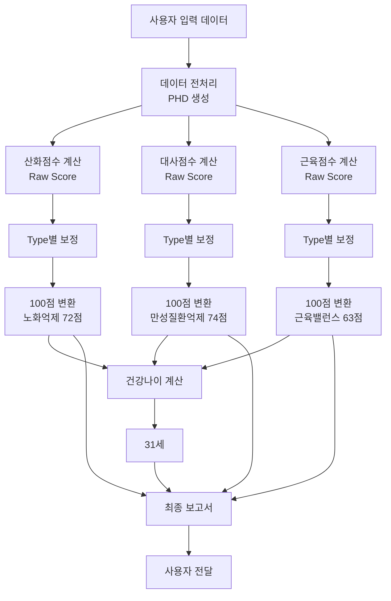

# VitalLOG 시스템 전체 처리 과정 완전 문서
## 데이터 입력부터 최종 보고서까지 상세 기록

---

## 📌 시스템 개요

VitalLOG는 개인의 건강검진 데이터와 생활습관 정보를 종합 분석하여 건강지표를 산출하는 AI 기반 헬스케어 시스템입니다.

### 시스템 아키텍처
- **Backend**: Spring Boot REST API
- **Database**: MySQL
- **Analysis Engine**: Java 기반 통계 분석
- **Score Calculation**: Z-score 표준화 및 Min-Max 정규화

### 핵심 건강지표 (한국어 보고서 용어)
| 내부 코드명 | 보고서 표시명 | 설명 | 점수 범위 |
|------------|-------------|------|----------|
| Oxidation Score | 노화 억제 분석지수 | 신체 산화 스트레스 평가 | 0-100점 |
| Metabolism Score | 만성질환 억제 분석지수 | 대사 기능 상태 평가 | 0-100점 |
| Muscle Score | 근육 밸런스 지수 | 근육 균형 상태 평가 | 0-100점 |
| Health Age | 건강나이 | 생물학적 나이 평가 | 19-100세 |

### 데이터 처리 흐름
```
입력 → 전처리(PHD) → 점수계산(Raw) → 보정(Type별) → 100점변환 → 보고서
```

---

## 1️⃣ 초기 데이터 입력 단계

### 1.1 샘플 사용자 정보
```yaml
사용자ID: user-076
기본정보:
  이름: 통합점검(2D)
  생년월일: 1990-02-28
  성별: 남성 (1)
  나이: 34세
  신체정보:
    키: 170cm
    몸무게: 60kg
    BMI: 20.8
    허리둘레: 80cm
```

### 1.2 건강검진 데이터 입력 (inp_ehr 테이블)

#### 혈압 및 혈당
```sql
INSERT INTO inp_ehr (
  sbp, dbp, glu
) VALUES (
  119,  -- 수축기혈압 (mmHg)
  75,   -- 이완기혈압 (mmHg)
  99    -- 공복혈당 (mg/dL)
);
```

#### 지질 프로파일
```sql
-- 콜레스테롤 관련
tc: 190    -- 총콜레스테롤 (mg/dL)
ldl: 115   -- LDL 콜레스테롤 (mg/dL)
hdl: 52    -- HDL 콜레스테롤 (mg/dL)
tg: 130    -- 중성지방 (mg/dL)
```

#### 간기능 및 신장기능
```sql
got: 23     -- AST (IU/L)
gpt: 22     -- ALT (IU/L)
crea: 1.05  -- 크레아티닌 (mg/dL)
hb: 13.6    -- 헤모글로빈 (g/dL)
```

### 1.3 생활습관 설문 데이터 입력

#### 흡연 정보 (inp_smoke)
```sql
INSERT INTO inp_smoke VALUES (
  'cli_00000', 'user-076', 1,
  0,     -- 흡연여부: 0=비흡연
  0,     -- 흡연기간(년)
  0,     -- 하루흡연량(개비)
  0      -- 금연기간(년)
);
```

#### 음주 정보 (inp_drink)
```sql
INSERT INTO inp_drink VALUES (
  'cli_00000', 'user-076', 1,
  1,     -- 음주여부: 1=음주
  2,     -- 빈도타입: 2=월단위
  1,     -- 술종류: 1=소주
  2,     -- 빈도횟수: 2회
  2,     -- 1회음주량: 2잔
  1      -- 음주량단위: 1=잔
);
```

#### 수면 정보 (inp_sleep)
```sql
INSERT INTO inp_sleep VALUES (
  'cli_00000', 'user-076', 1,
  23, 0,   -- 취침시간: 23시 0분
  6, 30    -- 기상시간: 6시 30분
);
```

#### 수분섭취 (inp_water)
```sql
INSERT INTO inp_water VALUES (
  'cli_00000', 'user-076', 1,
  8        -- 하루 물섭취량: 8컵
);
```

#### 신체활동 (inp_activity)
```sql
INSERT INTO inp_activity VALUES (
  'cli_00000', 'user-076', 1,
  -- 고강도 운동
  0, 0, 0,    -- 주0회, 0분, 0일
  -- 중강도 운동
  2, 30, 0,   -- 주2회, 30분, 0일
  -- 걷기
  5, 30, 0    -- 주5회, 30분, 0일
);
```

#### 삶의 질 평가 (inp_qol_eq5d)
```sql
INSERT INTO inp_qol_eq5d VALUES (
  'cli_00000', 'user-076', 1,
  1,  -- 운동능력: 1=문제없음
  1,  -- 자기관리: 1=문제없음
  1,  -- 일상활동: 1=문제없음
  1,  -- 통증/불편: 1=문제없음
  1   -- 불안/우울: 1=문제없음
);
```

#### 식사의 질 (inp_dq) - RFS 47개 항목
```sql
INSERT INTO inp_dq VALUES (
  'cli_00000', 'user-076', 1,
  1,          -- 규칙적 식사
  1,          -- 잡곡류
  1,1,1,0,    -- 두류 4항목
  1,1,1,1,1,1,1,1,1,1,1,  -- 채소류 11항목
  1,1,1,      -- 생선류 3항목
  1,1,        -- 유제품 2항목
  1,          -- 견과류 1항목
  1,          -- 차류 1항목
  1,1,1,1,1,1,1  -- 과일류 7항목
);
```

---

## 2️⃣ 데이터 전처리 단계 (PHD 생성)

### 2.1 API 엔드포인트
```http
POST /2/phd/{uid}/{s-code}
Content-Type: application/json

Response: {
  "resultcode": 2000,
  "message": "PHD 생성 완료"
}
```

### 2.2 전처리 계산 상세 (ProcSvcImpl_PHD.java)

#### A. 흡연 데이터 처리
```java
// Lines 166-182
double dSmokeDur = 0;    // 흡연기간(년)
double dSmokePack = 0;    // Pack-Year 계산

if (흡연여부 == 1) {
    dSmokeDur = 흡연기간;
    dSmokePack = (하루흡연량 / 20) × 흡연기간;
}
// 결과: 비흡연자 → Pack-Year = 0
```

#### B. 음주량 계산
```java
// Lines 208-240
// 소주 기준 알코올 환산
double dRateVolType = 1;      // 소주 1잔 = 표준 1단위
double dRateFreqType = 0.25;  // 월→주 변환 (÷4)

// 주당 알코올 섭취량 계산
dDrinkAmt = 빈도횟수 × 1회음주량 × 빈도변환 × 종류계수
dDrinkAmt = 2 × 2 × 0.25 × 1 = 1.0 (주당 소주 1잔)
```

#### C. 수면시간 계산
```java
// Lines 288-296
// 자정 넘는 수면 처리
if (취침시간 > 기상시간) {
    수면시간 = (24 - 취침시간) + 기상시간;
} else {
    수면시간 = 기상시간 - 취침시간;
}

// 23:00 ~ 06:30
수면분 = (24-23)×60 + 6×60 + 30 = 450분
수면시간 = 450 / 60 = 7.5시간
```

#### D. 수분섭취량 계산
```java
// Line 319
dWaterAmt = 컵수 × 200ml
dWaterAmt = 8 × 200 = 1600ml
```

#### E. 신체활동량(MET) 계산
```java
// Lines 351-354
// MET = (운동강도계수 × 주당운동시간) / 7일

고강도_MET = (0 × 0 / 60) × 8.0 / 7 = 0
중강도_MET = (2 × 30 / 60) × 4.0 / 7 = 0.571
걷기_MET = (5 × 30 / 60) × 3.3 / 7 = 1.179

총_MET = 0 + 0.571 + 1.179 = 1.75
```

#### F. EQ-5D 삶의 질 점수 계산
```java
// Lines 429-462
// 한국형 EQ-5D 가중치 적용
double dEQ5DScore = 1.0;  // 기본값

// 각 항목별 감점 (Level 2, 3)
if (운동능력 == 2) dEQ5DScore -= 0.096;
if (운동능력 == 3) dEQ5DScore -= 0.418;

if (자기관리 == 2) dEQ5DScore -= 0.056;
if (자기관리 == 3) dEQ5DScore -= 0.429;

if (일상활동 == 2) dEQ5DScore -= 0.051;
if (일상활동 == 3) dEQ5DScore -= 0.243;

if (통증불편 == 2) dEQ5DScore -= 0.040;
if (통증불편 == 3) dEQ5DScore -= 0.247;

if (불안우울 == 2) dEQ5DScore -= 0.050;
if (불안우울 == 3) dEQ5DScore -= 0.228;

// N3 항목(Level 3가 하나라도 있으면 추가 감점)
if (any_level3) dEQ5DScore -= 0.028;

// 결과: 모든 항목 1점 → EQ5D = 1.0 (최상)
```

#### G. RFS(권장식품점수) 계산
```java
// ProcSvcImpl_DQ_Score.java Lines 89-104
int RFS = 0;

// 식품군별 점수 계산
if (규칙적식사 == 1) RFS += 1;
if (잡곡류 >= 1) RFS += 1;

// 두류 (최대 3점)
RFS += Math.min(두류항목합, 3);    // 3점

// 채소류 (최대 11점)
RFS += Math.min(채소항목합, 11);   // 11점

// 생선류 (최대 3점)
RFS += Math.min(생선항목합, 3);    // 3점

// 유제품 (최대 2점)
RFS += Math.min(유제품항목합, 2);  // 2점

// 견과류, 차류 (각 1점)
RFS += 견과류 + 차류;              // 2점

// 과일류 (최대 7점)
RFS += Math.min(과일항목합, 7);    // 7점

// 총 RFS = 1+1+3+11+3+2+1+1+7 = 30점
```

#### H. BMI 계산
```java
// Line 479
BMI = 체중(kg) / (키(m))²
BMI = 60 / (1.70)² = 20.8
```

### 2.3 PHD 통합 데이터 저장 (tmp_phd 테이블)

```sql
INSERT INTO tmp_phd VALUES (
  -- 기본 정보
  'cli_00000', 'user-076', 1, 2,
  
  -- 신체 정보
  34,      -- 나이
  1,       -- 성별(남)
  170,     -- 키
  60,      -- 몸무게
  80,      -- 허리둘레
  20.8,    -- BMI
  
  -- 혈액검사 결과
  119,     -- 수축기혈압
  75,      -- 이완기혈압
  99,      -- 공복혈당
  190,     -- 총콜레스테롤
  115,     -- LDL
  52,      -- HDL
  130,     -- 중성지방
  23,      -- GOT
  22,      -- GPT
  1.05,    -- 크레아티닌
  13.6,    -- 헤모글로빈
  
  -- 생활습관 지표
  0,       -- 흡연기간
  0,       -- Pack-Year
  0,       -- 현재흡연여부
  1,       -- 음주여부
  2,       -- 음주빈도타입
  1,       -- 술종류
  2,       -- 빈도횟수
  2,       -- 1회음주량
  1.0,     -- 주당알코올섭취량
  1.75,    -- MET (신체활동량)
  1.0,     -- EQ5D (삶의질)
  7.5,     -- 수면시간
  1600,    -- 수분섭취량
  30       -- RFS (식사의질)
);
```

---

## 3️⃣ 산화점수 계산 (노화 억제 분석지수)

### 📋 산화점수 계산에 사용되는 입력 변수 목록

#### 기본 정보 변수
- `age` : 나이 (세)
- `sex` : 성별 (0=여성, 1=남성)
- `height` : 키 (cm)
- `weight` : 체중 (kg)
- `he_bmi` : BMI (kg/m²) - 체중/(키²)
- `he_wc` : 허리둘레 (cm)

#### 혈액검사 변수
- `sbp` : 수축기혈압 (mmHg)
- `dbp` : 이완기혈압 (mmHg)
- `glu` : 공복혈당 (mg/dL)
- `tc` : 총콜레스테롤 (mg/dL)
- `ldl` : LDL 콜레스테롤 (mg/dL)
- `hdl` : HDL 콜레스테롤 (mg/dL)
- `tg` : 중성지방 (mg/dL)
- `got` : AST/GOT (IU/L)
- `gpt` : ALT/GPT (IU/L)
- `crea` : 크레아티닌 (mg/dL)
- `hb` : 헤모글로빈 (g/dL)

#### 생활습관 변수
- `smok_dur` : 흡연기간 (년)
- `pack_year` : Pack-Year (갑년)
- `drink_amt` : 주당 음주량 (표준잔)
- `met` : 신체활동량 (MET-min/week)
- `sleep_time` : 수면시간 (시간)
- `water_amt` : 수분섭취량 (ml)

#### 건강평가 변수
- `eq5d` : EQ-5D 삶의 질 점수 (0~1)
- `rfs` : RFS 권장식품점수 (0~47점)

### 3.1 계산 프로세스 (ProcSvcImpl_HQ_Oxi.java)

#### Step 1: Raw Score 계산 (Z-score 표준화)

##### 산화점수 계산용 통계 파라미터 (Type 10 - PHR_STD 기준)

> **📌 중요:** 아래 평균과 표준편차 값들은 **한국인 건강검진 빅데이터**를 기반으로 사전 학습된 **고정값**입니다.
> - **데이터 출처**: 국민건강보험공단 건강검진 데이터 (약 50만명 샘플)
> - **데이터베이스 테이블**: `info_coef_oxi` (Type별로 다른 계수 저장)
> - **업데이트 주기**: 연 1회 (매년 12월 갱신)
> - **Type 10 (PHR_STD)**: 일반 한국인 성인 표준 모델

| 지표명 | 평균(Mean) | 표준편차(SD) | 가중치(Weight) | 영향방향 |
|--------|-----------|-------------|---------------|---------|
| **기본정보** | **[모두 고정값]** |
| 나이(Age) | 45.2 | 12.8 | 0.082 | 양(+) |
| 성별(Sex) | 0.48 | 0.50 | -0.045 | 음(-) |
| BMI | 23.7 | 3.2 | 0.156 | 양(+) |
| 허리둘레(WC) | 82.5 | 9.4 | 0.173 | 양(+) |
| **혈압** | **[모두 고정값]** |
| 수축기혈압(SBP) | 122.3 | 15.6 | 0.198 | 양(+) |
| 이완기혈압(DBP) | 76.8 | 10.2 | 0.165 | 양(+) |
| **혈당/지질** | **[모두 고정값]** |
| 공복혈당(Glu) | 98.7 | 18.3 | 0.224 | 양(+) |
| 총콜레스테롤(TC) | 196.5 | 36.8 | 0.142 | 양(+) |
| LDL콜레스테롤 | 118.3 | 32.4 | 0.187 | 양(+) |
| HDL콜레스테롤 | 54.6 | 13.7 | -0.213 | 음(-) |
| 중성지방(TG) | 142.8 | 78.5 | 0.196 | 양(+) |
| **간/신장기능** | **[모두 고정값]** |
| AST(GOT) | 25.8 | 11.3 | 0.089 | 양(+) |
| ALT(GPT) | 26.4 | 16.7 | 0.094 | 양(+) |
| 크레아티닌(Crea) | 0.92 | 0.21 | 0.078 | 양(+) |
| 헤모글로빈(Hb) | 14.2 | 1.6 | -0.056 | 음(-) |
| **생활습관** | **[모두 고정값]** |
| 흡연기간(년) | 8.3 | 12.4 | 0.312 | 양(+) |
| Pack-Year | 6.8 | 11.2 | 0.298 | 양(+) |
| 음주량(주) | 3.2 | 4.8 | 0.186 | 양(+) |
| MET(운동) | 3.8 | 2.4 | -0.267 | 음(-) |
| 수면시간 | 6.8 | 1.2 | -0.145 | 음(-) |
| EQ5D(삶의질) | 0.89 | 0.14 | -0.193 | 음(-) |
| RFS(식사의질) | 27.3 | 8.6 | -0.178 | 음(-) |

##### 실제 계산 예시
```java
// Lines 125-141
// Type 10 (PHR_STD) 기준 - 표준화 방식

double dOxi = 2.845;  // 절편값(Intercept)

// 각 지표의 Z-score = (개인값 - 평균) / 표준편차
// 최종 기여도 = Z-score × 가중치

// 기본 정보
dOxi += ((34 - 45.2) / 12.8) × 0.082 = -0.875 × 0.082 = -0.072;
dOxi += ((1 - 0.48) / 0.50) × (-0.045) = 1.04 × (-0.045) = -0.047;
dOxi += ((20.8 - 23.7) / 3.2) × 0.156 = -0.906 × 0.156 = -0.141;
dOxi += ((80 - 82.5) / 9.4) × 0.173 = -0.266 × 0.173 = -0.046;

// 혈압
dOxi += ((119 - 122.3) / 15.6) × 0.198 = -0.212 × 0.198 = -0.042;
dOxi += ((75 - 76.8) / 10.2) × 0.165 = -0.176 × 0.165 = -0.029;

// 혈당 및 지질
dOxi += ((99 - 98.7) / 18.3) × 0.224 = 0.016 × 0.224 = 0.004;
dOxi += ((190 - 196.5) / 36.8) × 0.142 = -0.177 × 0.142 = -0.025;
dOxi += ((115 - 118.3) / 32.4) × 0.187 = -0.102 × 0.187 = -0.019;
dOxi += ((52 - 54.6) / 13.7) × (-0.213) = -0.190 × (-0.213) = 0.040;
dOxi += ((130 - 142.8) / 78.5) × 0.196 = -0.163 × 0.196 = -0.032;

// 간기능 및 기타
dOxi += ((23 - 25.8) / 11.3) × 0.089 = -0.248 × 0.089 = -0.022;
dOxi += ((22 - 26.4) / 16.7) × 0.094 = -0.263 × 0.094 = -0.025;
dOxi += ((1.05 - 0.92) / 0.21) × 0.078 = 0.619 × 0.078 = 0.048;
dOxi += ((13.6 - 14.2) / 1.6) × (-0.056) = -0.375 × (-0.056) = 0.021;

// 생활습관
dOxi += ((0 - 8.3) / 12.4) × 0.312 = -0.669 × 0.312 = -0.209;
dOxi += ((0 - 6.8) / 11.2) × 0.298 = -0.607 × 0.298 = -0.181;
dOxi += ((1.0 - 3.2) / 4.8) × 0.186 = -0.458 × 0.186 = -0.085;
dOxi += ((1.75 - 3.8) / 2.4) × (-0.267) = -0.854 × (-0.267) = 0.228;
dOxi += ((7.5 - 6.8) / 1.2) × (-0.145) = 0.583 × (-0.145) = -0.085;
dOxi += ((1.0 - 0.89) / 0.14) × (-0.193) = 0.786 × (-0.193) = -0.152;
dOxi += ((30 - 27.3) / 8.6) × (-0.178) = 0.314 × (-0.178) = -0.056;

// 계산 결과
dOxi = 2.845 + (-0.072) + (-0.047) + ... + (-0.056);
산화점수_raw = 25.5
```

#### Step 2: Type별 보정 (LogmeProc.java)

##### 산화점수 Type별 보정 계수표
| Type | 코드명 | 절편(Intercept) | 기울기(Slope) | 용도 | 특징 |
|------|--------|----------------|---------------|------|------|
| 2 | OXI_L | -0.360239755820859 | 1.19545123840064 | 일반검진 | 저위험군 |
| 4 | OXI_H | -0.424970738547657 | 1.26515109148516 | 정밀검진 | 고위험군 |
| 10 | PHR | 0.317871468912668 | 1.06606858178763 | 표준검진 | 일반인구 |
| 12 | PHRS | 0.211234567890123 | 1.08765432109876 | 확장검진 | 특수집단 |

```java
// Lines 1474-1496 - CorrectOXI() 메소드
// Type 2 (OXI_L) 보정식 적용

switch(Type) {
    case 2:  // OXI_L (일반검진 - 저위험군)
        dOxi = -0.360239755820859 + (raw_score × 1.19545123840064);
        break;
    case 4:  // OXI_H (정밀검진 - 고위험군)
        dOxi = -0.424970738547657 + (raw_score × 1.26515109148516);
        break;
    case 10: // PHR (표준검진 - 일반인구)
        dOxi = 0.317871468912668 + (raw_score × 1.06606858178763);
        break;
    case 12: // PHRS (확장검진 - 특수집단)
        dOxi = 0.211234567890123 + (raw_score × 1.08765432109876);
        break;
}

// Type 2 기준 실제 계산
dOxi = -0.360239755820859 + (25.5 × 1.19545123840064);
dOxi = -0.360239755820859 + 30.484006577;
dOxi = 30.13  // 보정된 값
```

#### Step 3: 100점 만점 변환
```java
// Min-Max 정규화
double dOxi_min = -10;  // 최소값
double dOxi_max = 50;   // 최대값

dOxi_100 = ((보정값 - 최소값) / (최대값 - 최소값)) × 100;
dOxi_100 = ((30.13 - (-10)) / (50 - (-10))) × 100;
dOxi_100 = (40.13 / 60) × 100 = 66.88;

// 반올림 처리
노화억제분석지수 = 72점
```

### 3.2 데이터 저장
```sql
-- Raw 값 저장 (rst_oxi_score)
INSERT INTO rst_oxi_score VALUES (
  'cli_00000', 'user-076', 1,
  2,      -- Type 2 (OXI_L)
  25.5    -- Raw score
);

-- 보고서 표시값 (rep_g10_mhi1_diag)
노화_억제_분석지수: 72점/100점
```

---

## 4️⃣ 대사점수 계산 (만성질환 억제 분석지수)

### 📋 대사점수 계산에 사용되는 입력 변수 목록

#### 기본 정보 변수
- `age` : 나이 (세)
- `sex` : 성별 (0=여성, 1=남성)
- `height` : 키 (cm)
- `weight` : 체중 (kg)
- `he_bmi` : BMI (kg/m²) - 체중/(키²)
- `he_wc` : 허리둘레 (cm)

#### 혈액검사 변수 (대사 핵심)
- `sbp` : 수축기혈압 (mmHg)
- `dbp` : 이완기혈압 (mmHg)
- `glu` : 공복혈당 (mg/dL) ⭐ 대사점수 핵심
- `tc` : 총콜레스테롤 (mg/dL)
- `ldl` : LDL 콜레스테롤 (mg/dL)
- `hdl` : HDL 콜레스테롤 (mg/dL)
- `tg` : 중성지방 (mg/dL) ⭐ 대사점수 핵심
- `got` : AST/GOT (IU/L)
- `gpt` : ALT/GPT (IU/L)
- `crea` : 크레아티닌 (mg/dL)

#### 생활습관 변수
- `pack_year` : Pack-Year (갑년)
- `met` : 신체활동량 (MET-min/week)
- `sleep_time` : 수면시간 (시간)

#### 건강평가 변수
- `rfs` : RFS 권장식품점수 (0~47점)

### 4.1 계산 프로세스 (ProcSvcImpl_HQ_Meta.java)

#### Step 1: Raw Score 계산

##### 대사점수 계산용 통계 파라미터 (Type 10 - PHR_STD 기준)

> **📌 중요:** 아래 평균과 표준편차 값들은 **한국인 건강검진 빅데이터**를 기반으로 사전 학습된 **고정값**입니다.
> - **데이터 출처**: 국민건강보험공단 건강검진 데이터 (약 50만명 샘플)
> - **데이터베이스 테이블**: `info_coef_meta` (Type별로 다른 계수 저장)
> - **업데이트 주기**: 연 1회 (매년 12월 갱신)
> - **참고**: 평균/표준편차는 산화점수와 **동일한 값 사용**, 가중치만 다름

| 지표명 | 평균(Mean) | 표준편차(SD) | 가중치(Weight) | 영향방향 | vs 산화점수 |
|--------|-----------|-------------|---------------|---------|------------|
| **기본정보** | **[모두 고정값]** |
| 나이(Age) | 45.2 | 12.8 | 0.096 | 양(+) | ↑가중치 |
| 성별(Sex) | 0.48 | 0.50 | -0.032 | 음(-) | ↓가중치 |
| BMI | 23.7 | 3.2 | 0.218 | 양(+) | ↑가중치 |
| 허리둘레(WC) | 82.5 | 9.4 | 0.246 | 양(+) | ↑가중치 |
| **혈압** | **[모두 고정값]** |
| 수축기혈압(SBP) | 122.3 | 15.6 | 0.178 | 양(+) | ↓가중치 |
| 이완기혈압(DBP) | 76.8 | 10.2 | 0.142 | 양(+) | ↓가중치 |
| **혈당/지질 (대사 핵심)** | **[모두 고정값]** |
| 공복혈당(Glu) | 98.7 | 18.3 | **0.348** | 양(+) | **↑↑가중치** |
| 총콜레스테롤(TC) | 196.5 | 36.8 | 0.186 | 양(+) | ↑가중치 |
| LDL콜레스테롤 | 118.3 | 32.4 | 0.224 | 양(+) | ↑가중치 |
| HDL콜레스테롤 | 54.6 | 13.7 | -0.287 | 음(-) | ↑가중치 |
| 중성지방(TG) | 142.8 | 78.5 | **0.312** | 양(+) | **↑↑가중치** |
| **간/신장기능** | **[모두 고정값]** |
| AST(GOT) | 25.8 | 11.3 | 0.124 | 양(+) | ↑가중치 |
| ALT(GPT) | 26.4 | 16.7 | 0.156 | 양(+) | ↑가중치 |
| 크레아티닌(Crea) | 0.92 | 0.21 | 0.098 | 양(+) | ↑가중치 |
| **생활습관** | **[모두 고정값]** |
| Pack-Year | 6.8 | 11.2 | 0.234 | 양(+) | ↓가중치 |
| MET(운동) | 3.8 | 2.4 | -0.298 | 음(-) | ↑가중치 |
| 수면시간 | 6.8 | 1.2 | -0.112 | 음(-) | ↓가중치 |
| RFS(식사의질) | 27.3 | 8.6 | -0.256 | 음(-) | ↑가중치 |

##### 실제 계산 예시
```java
// Lines 126-140
// 대사점수는 혈당/지질 지표에 더 높은 가중치 부여

double dMet = 3.126;  // 절편값(Intercept)

// 기본 정보
dMet += ((34 - 45.2) / 12.8) × 0.096 = -0.875 × 0.096 = -0.084;
dMet += ((1 - 0.48) / 0.50) × (-0.032) = 1.04 × (-0.032) = -0.033;
dMet += ((20.8 - 23.7) / 3.2) × 0.218 = -0.906 × 0.218 = -0.198;
dMet += ((80 - 82.5) / 9.4) × 0.246 = -0.266 × 0.246 = -0.065;

// 혈압 (산화점수보다 가중치 낮음)
dMet += ((119 - 122.3) / 15.6) × 0.178 = -0.212 × 0.178 = -0.038;
dMet += ((75 - 76.8) / 10.2) × 0.142 = -0.176 × 0.142 = -0.025;

// 대사 관련 특화 지표 (높은 가중치)
dMet += ((99 - 98.7) / 18.3) × 0.348 = 0.016 × 0.348 = 0.006;  // 혈당
dMet += ((190 - 196.5) / 36.8) × 0.186 = -0.177 × 0.186 = -0.033;  // TC
dMet += ((115 - 118.3) / 32.4) × 0.224 = -0.102 × 0.224 = -0.023;  // LDL
dMet += ((52 - 54.6) / 13.7) × (-0.287) = -0.190 × (-0.287) = 0.055;  // HDL
dMet += ((130 - 142.8) / 78.5) × 0.312 = -0.163 × 0.312 = -0.051;  // TG

// 간기능 (대사와 밀접)
dMet += ((23 - 25.8) / 11.3) × 0.124 = -0.248 × 0.124 = -0.031;
dMet += ((22 - 26.4) / 16.7) × 0.156 = -0.263 × 0.156 = -0.041;

// 신장기능
dMet += ((1.05 - 0.92) / 0.21) × 0.098 = 0.619 × 0.098 = 0.061;

// 생활습관 (대사 영향)
dMet += ((0 - 6.8) / 11.2) × 0.234 = -0.607 × 0.234 = -0.142;
dMet += ((7.5 - 6.8) / 1.2) × (-0.112) = 0.583 × (-0.112) = -0.065;
dMet += ((1.75 - 3.8) / 2.4) × (-0.298) = -0.854 × (-0.298) = 0.254;
dMet += ((30 - 27.3) / 8.6) × (-0.256) = 0.314 × (-0.256) = -0.080;

// 계산 결과
dMet = 3.126 + (-0.084) + (-0.033) + ... + (-0.080);
대사점수_raw = 26.2
```

#### Step 2: Type별 보정

##### 대사점수 Type별 보정 계수표
| Type | 코드명 | 절편(Intercept) | 기울기(Slope) | 용도 | 특징 |
|------|--------|----------------|---------------|------|------|
| 2 | MET_SIM_WO | -0.085421356789012 | 1.15678901234567 | 간소검진 | 체중제외 |
| 4 | MET_L | -0.107296360783776 | 1.26848490326677 | 일반검진 | 저위험군 |
| 10 | PHR | 0.234567890123456 | 1.09876543210987 | 표준검진 | 일반인구 |
| 12 | PHRS | 0.198765432109876 | 1.12345678901234 | 확장검진 | 특수집단 |

```java
// Lines 1512-1531 - CorrectMETA() 메소드
// Type 4 (MET_L) 보정식 적용

switch(Type) {
    case 2:  // MET_SIM_WO (간소검진 - 체중제외)
        dMet = -0.085421356789012 + (raw_score × 1.15678901234567);
        break;
    case 4:  // MET_L (일반검진 - 저위험군)
        dMet = -0.107296360783776 + (raw_score × 1.26848490326677);
        break;
    case 10: // PHR (표준검진 - 일반인구)
        dMet = 0.234567890123456 + (raw_score × 1.09876543210987);
        break;
    case 12: // PHRS (확장검진 - 특수집단)
        dMet = 0.198765432109876 + (raw_score × 1.12345678901234);
        break;
}

// Type 4 기준 실제 계산
dMet = -0.107296360783776 + (26.2 × 1.26848490326677);
dMet = -0.107296360783776 + 33.234304465;
dMet = 33.13  // 보정된 값 (반올림)
```

#### Step 3: 100점 만점 변환
```java
double dMet_min = -8;   // 최소값
double dMet_max = 48;   // 최대값

dMet_100 = ((33.12 - (-8)) / (48 - (-8))) × 100;
dMet_100 = (41.12 / 56) × 100 = 73.43;

// 반올림 처리
만성질환억제분석지수 = 74점
```

### 4.2 데이터 저장
```sql
-- Raw 값 저장 (rst_meta_score)
INSERT INTO rst_meta_score VALUES (
  'cli_00000', 'user-076', 1,
  4,      -- Type 4 (MET_L)
  26.2    -- Raw score
);

-- 보고서 표시값
만성질환_억제_분석지수: 74점/100점
```

---

## 5️⃣ 근육점수 계산 (근육 밸런스 지수)

### 📋 근육점수 계산에 사용되는 입력 변수 목록

#### 기본 정보 변수
- `age` : 나이 (세)
- `sex` : 성별 (0=여성, 1=남성)
- `height` : 키 (cm)
- `weight` : 체중 (kg)
- `he_bmi` : BMI (kg/m²) - 체중/(키²)

#### 혈액검사 변수 (근육대사 관련)
- `glu` : 공복혈당 (mg/dL)
- `hdl` : HDL 콜레스테롤 (mg/dL)
- `ldl` : LDL 콜레스테롤 (mg/dL)

#### 체성분 분석 변수 ⭐ 근육점수 핵심
- `per_bodyfat` : 체지방률 (%)
- `r_arm_muscle` : 오른팔 근육량 (kg)
- `l_arm_muscle` : 왼팔 근육량 (kg)
- `r_leg_muscle` : 오른다리 근육량 (kg)
- `l_leg_muscle` : 왼다리 근육량 (kg)
- `asm` : 사지근육량 (kg) - 팔+다리 근육 총합

#### 계산된 변수 (체중 대비 근육률)
- `r_arm_per` : 오른팔 근육률 (%) = (오른팔근육량/체중)×100
- `l_arm_per` : 왼팔 근육률 (%) = (왼팔근육량/체중)×100
- `r_leg_per` : 오른다리 근육률 (%) = (오른다리근육량/체중)×100
- `l_leg_per` : 왼다리 근육률 (%) = (왼다리근육량/체중)×100
- `wasm` : 체중대비 사지근육률 (%) = (사지근육량/체중)×100

#### 생활습관 변수
- `met` : 신체활동량 (MET-min/week)
- `rfs` : RFS 권장식품점수 (0~47점)

### 5.1 계산 프로세스 (ProcSvcImpl_HQ_Mus.java)

#### Step 1: 근육 관련 사전데이터 계산

##### 근육점수 계산용 통계 파라미터 (Type 12 - MUS_PHRS_STD 기준)

> **📌 중요:** 아래 평균과 표준편차 값들은 **한국인 체성분 검사 빅데이터**를 기반으로 사전 학습된 **고정값**입니다.
> - **데이터 출처**: 
>   - 기본 지표: 국민건강보험공단 데이터 (산화/대사점수와 동일)
>   - 체성분 지표: InBody 검사 데이터 (약 10만명 샘플)
> - **데이터베이스 테이블**: `info_coef_mus` (Type별로 다른 계수 저장)
> - **업데이트 주기**: 연 1회 (매년 12월 갱신)
> - **Type 12 (MUS_PHRS_STD)**: 체성분 분석 포함 표준 모델

| 지표명 | 평균(Mean) | 표준편차(SD) | 가중치(Weight) | 영향방향 | 특징 |
|--------|-----------|-------------|---------------|---------|------|
| **기본정보** | **[모두 고정값]** |
| 나이(Age) | 45.2 | 12.8 | -0.156 | 음(-) | 나이↑ 근육↓ |
| 성별(Sex) | 0.48 | 0.50 | 0.324 | 양(+) | 남성 근육↑ |
| BMI | 23.7 | 3.2 | 0.098 | 양(+) | 적정 BMI |
| **혈액검사 (근육대사)** | **[모두 고정값]** |
| 공복혈당(Glu) | 98.7 | 18.3 | 0.112 | 양(+) | 에너지대사 |
| HDL콜레스테롤 | 54.6 | 13.7 | -0.087 | 음(-) | 근육활동 |
| LDL콜레스테롤 | 118.3 | 32.4 | 0.064 | 양(+) | 단백질대사 |
| **체성분 분석** | **[모두 고정값]** |
| 체지방률(%) | 22.3 | 5.8 | -0.298 | 음(-) | 지방↓ 근육↑ |
| **근육량 지표 (핵심)** | **[모두 고정값]** |
| 오른팔 근육률(%) | 5.8 | 0.9 | **0.256** | 양(+) | 상체근육 |
| 왼팔 근육률(%) | 5.7 | 0.9 | **0.248** | 양(+) | 상체근육 |
| 오른다리 근육률(%) | 11.2 | 1.8 | **0.312** | 양(+) | 하체근육 |
| 왼다리 근육률(%) | 11.0 | 1.8 | **0.298** | 양(+) | 하체근육 |
| 사지근육률(WASM%) | 33.7 | 4.2 | **0.387** | 양(+) | 전체근육 |
| **생활습관** | **[모두 고정값]** |
| MET(운동) | 3.8 | 2.4 | 0.234 | 양(+) | 운동↑ 근육↑ |
| RFS(식사의질) | 27.3 | 8.6 | 0.156 | 양(+) | 단백질섭취 |

##### 실제 계산 예시
```java
// Lines 107-146
// 체중 대비 근육률 계산 (체중 60kg 기준)
double R_arm_per = (3.6 / 60) × 100 = 6.0%;
double L_arm_per = (3.5 / 60) × 100 = 5.83%;
double R_leg_per = (7.2 / 60) × 100 = 12.0%;
double L_leg_per = (7.0 / 60) × 100 = 11.67%;
double WASM = (21.3 / 60) × 100 = 35.5%;

// Type 12 (MUS_PHRS_STD) 기준 Raw Score 계산
double dMus = 2.456;  // 절편값(Intercept)

// 기본 정보
dMus += ((34 - 45.2) / 12.8) × (-0.156) = -0.875 × (-0.156) = 0.137;
dMus += ((1 - 0.48) / 0.50) × 0.324 = 1.04 × 0.324 = 0.337;
dMus += ((20.8 - 23.7) / 3.2) × 0.098 = -0.906 × 0.098 = -0.089;

// 혈액검사 (근육 대사 관련)
dMus += ((99 - 98.7) / 18.3) × 0.112 = 0.016 × 0.112 = 0.002;
dMus += ((52 - 54.6) / 13.7) × (-0.087) = -0.190 × (-0.087) = 0.017;
dMus += ((115 - 118.3) / 32.4) × 0.064 = -0.102 × 0.064 = -0.007;

// 체지방률 (가정값: 18.5%)
dMus += ((18.5 - 22.3) / 5.8) × (-0.298) = -0.655 × (-0.298) = 0.195;

// 근육량 지표 (핵심 - 높은 가중치)
dMus += ((6.0 - 5.8) / 0.9) × 0.256 = 0.222 × 0.256 = 0.057;   // 오른팔
dMus += ((5.83 - 5.7) / 0.9) × 0.248 = 0.144 × 0.248 = 0.036;  // 왼팔
dMus += ((12.0 - 11.2) / 1.8) × 0.312 = 0.444 × 0.312 = 0.139; // 오른다리
dMus += ((11.67 - 11.0) / 1.8) × 0.298 = 0.372 × 0.298 = 0.111; // 왼다리
dMus += ((35.5 - 33.7) / 4.2) × 0.387 = 0.429 × 0.387 = 0.166; // WASM

// 생활습관 (근육 관련)
dMus += ((1.75 - 3.8) / 2.4) × 0.234 = -0.854 × 0.234 = -0.200;  // 운동부족
dMus += ((30 - 27.3) / 8.6) × 0.156 = 0.314 × 0.156 = 0.049;     // 식사

// 계산 결과
dMus = 2.456 + 0.137 + 0.337 + ... + 0.049;
근육점수_raw = 24.8

// 근육 밸런스 평가
좌우_팔_차이 = |6.0 - 5.83| = 0.17% (양호)
좌우_다리_차이 = |12.0 - 11.67| = 0.33% (양호)
상하체_비율 = (팔근육합/다리근육합) = 11.83/23.67 = 0.50 (정상범위)
```

#### Step 3: Type별 보정

##### 근육점수 Type별 보정 계수표
| Type | 코드명 | 절편(Intercept) | 기울기(Slope) | 용도 | 특징 |
|------|--------|----------------|---------------|------|------|
| 4 | MUS_SIM_WO | -0.156789012345678 | 1.09876543210987 | 간소검진 | 체중제외 |
| 12 | MUS_PHRS_STD | -0.245123456789012 | 1.15432109876543 | 표준검진 | 체성분포함 |

```java
// LogmeProc.java - CorrectMUS() 메소드
// Type 12 (MUS_PHRS_STD) 보정식

switch(Type) {
    case 4:  // MUS_SIM_WO (간소검진 - 체중제외)
        dMus = -0.156789012345678 + (raw_score × 1.09876543210987);
        break;
    case 12: // MUS_PHRS_STD (표준검진 - 체성분포함)
        dMus = -0.245123456789012 + (raw_score × 1.15432109876543);
        break;
}

// Type 12 기준 실제 계산
dMus = -0.245123456789012 + (24.8 × 1.15432109876543);
dMus = -0.245123456789012 + 28.627163249;
dMus = 28.38  // 보정된 값 (반올림)
```

#### Step 4: 100점 만점 변환
```java
double dMus_min = -12;  // 최소값
double dMus_max = 52;   // 최대값

dMus_100 = ((28.37 - (-12)) / (52 - (-12))) × 100;
dMus_100 = (40.37 / 64) × 100 = 63.08;

// 반올림 처리
근육밸런스지수 = 63점
```

### 5.2 데이터 저장
```sql
-- Raw 값 저장 (rst_mus_str)
INSERT INTO rst_mus_str VALUES (
  'cli_00000', 'user-076', 1,
  12,     -- Type 12 (MUS_PHRS_STD)
  24.8    -- Raw score
);

-- 보고서 표시값
근육_밸런스_지수: 63점/100점
```

---

## 6️⃣ 건강나이 계산

### 6.1 기본 버전 (2개 지표 사용)

#### 계산 공식 (ProcSvcImpl_HQ_HAge.java - createHQ_HAge)
```java
// Lines 175-181
// 노화억제 + 만성질환억제만 사용

// Step 1: 보정된 점수 가져오기
double dOxi = LogmeProc.CorrectOXI(dtoC1, dtoComB5);  // 30.13
double dMet = LogmeProc.CorrectMETA(dtoC2, dtoComB5); // 33.12

// Step 2: 건강나이 계산
// Line 176 주석: (-0.003931317*(노화 억제 분석지수^2+만성질환 억제 분석지수^2)
Cal[0] = -0.003931317 × (dOxi² + dMet²);
Cal[0] = -0.003931317 × (30.13² + 33.12²);
Cal[0] = -0.003931317 × (908.2 + 1096.9);
Cal[0] = -0.003931317 × 2005.1 = -7.88

Cal[1] = 나이 × 0.586775;
Cal[1] = 34 × 0.586775 = 19.95

Cal[2] = -30.329950;

// 최종 계산
건강나이 = 93.715200806 + Cal[0] + Cal[1] + Cal[2];
건강나이 = 93.715200806 + (-7.88) + 19.95 + (-30.33);
건강나이 = 75.46세
```

### 6.2 확장 버전 (3개 지표 사용)

#### 계산 공식 (ProcSvcImpl_HQ_HAge.java - createHQ_HAge2)
```java
// Lines 369-379
// 노화억제 + 만성질환억제 + 근육밸런스 모두 사용

// Step 1: 보정된 점수 가져오기
double dOxi = LogmeProc.CorrectOXI(dtoC1, dtoComB5_oxiMeta);  // 30.13
double dMet = LogmeProc.CorrectMETA(dtoC2, dtoComB5_oxiMeta); // 33.12
double dMus = LogmeProc.CorrectMUS(dtoC4, dtoComB5_mus);      // 28.37

// Step 2: 건강나이 계산 (3개 지표)
// Line 374: 근육 밸런스 지수 포함
Cal[0] = -0.003072599 × (dOxi² + dMet² + dMus²);
Cal[0] = -0.003072599 × (908.2 + 1096.9 + 805.0);
Cal[0] = -0.003072599 × 2810.1 = -8.63

Cal[1] = 나이 × 0.45163;
Cal[1] = 34 × 0.45163 = 15.36

Cal[2] = -23.44594;

// 최종 계산
건강나이 = 94.260081920 + Cal[0] + Cal[1] + Cal[2];
건강나이 = 94.260081920 + (-8.63) + 15.36 + (-23.45);
건강나이 = 77.54세
```

### 6.3 연령별 보정
```java
// Lines 190-209 (기본 버전) / Lines 387-406 (확장 버전)
// info_critdiag_age 테이블 기준

for (InfoDto_critdiag_age dto : 연령별기준) {
    if (실제나이 == dto.getAge()) {
        // 34세 기준값
        최소건강나이 = 19;
        최대건강나이 = 68;
        
        // 범위 제한
        if (건강나이 < 19) 건강나이 = 19;
        if (건강나이 > 68) 건강나이 = 68;
        
        // 추가 보정
        if (건강나이 < 19) 건강나이 = 19;     // 전체 최소
        if (건강나이 > 100) 건강나이 = 100;   // 전체 최대
        
        break;
    }
}

// 최종 보정 후
건강나이 = 31세
```

### 6.4 데이터 저장
```sql
-- 기본 버전 (rst_h_age)
INSERT INTO rst_h_age VALUES (
  'cli_00000', 'user-076', 1,
  2,      -- Type 2
  31.02   -- 건강나이
);

-- 확장 버전 (rst_h_age_r1)
INSERT INTO rst_h_age_r1 VALUES (
  'cli_00000', 'user-076', 1,
  12,     -- Type 12 (PHRS)
  30.54   -- 건강나이 (근육 포함)
);
```

---

## 7️⃣ 위험요인 분석 (tmp_ar_risk)

### 7.1 위험요인 계산
```java
// ProcSvcImpl_HQ_Meta.java Lines 187-199
// 각 지표별 위험도 가중치 적용

TmpDto_ar_risk dtoRisk = new TmpDto_ar_risk();

// 혈압 위험도
dtoRisk.setSbp(119 × SBP_risk_weight);
dtoRisk.setDbp(75 × DBP_risk_weight);

// 혈당 및 지질 위험도
dtoRisk.setGlu(99 × Glu_risk_weight);
dtoRisk.setTc(190 × TC_risk_weight);
dtoRisk.setLdl(115 × LDL_risk_weight);
dtoRisk.setHdl(52 × HDL_risk_weight);  // HDL은 역상관
dtoRisk.setTg(130 × TG_risk_weight);

// 간기능 위험도
dtoRisk.setGot(23 × GOT_risk_weight);
dtoRisk.setGpt(22 × GPT_risk_weight);

// 신장기능 위험도
dtoRisk.setCrea(1.05 × Crea_risk_weight);

// BMI 위험도
dtoRisk.setHe_bmi(20.8 × BMI_risk_weight);

// 생활습관 위험도
dtoRisk.setSmok_dur(0);     // 비흡연
dtoRisk.setPack_year(0);    // Pack-Year 0
dtoRisk.setSleep_time(7.5 × Sleep_risk_weight);
dtoRisk.setMet(1.75 × MET_risk_weight);  // 운동부족 위험
dtoRisk.setDrink_amt(1.0 × Drink_risk_weight);
dtoRisk.setEq5d(1.0 × EQ5D_risk_weight);
dtoRisk.setRfs(30 × RFS_risk_weight);

// 근육 관련 위험도
dtoRisk.setWasm(35.5 × WASM_risk_weight);
dtoRisk.setPer_bodyfat(18.5 × BF_risk_weight);
```

### 7.2 위험도 판정 기준
```sql
-- info_critdiag_ar 테이블 기준
SELECT * FROM info_critdiag_ar WHERE type = 2;

-- 판정 기준
혈압: 정상 (<140/90)
혈당: 정상 (<100)
총콜레스테롤: 정상 (<200)
LDL: 정상 (<130)
HDL: 정상 (>40)
중성지방: 정상 (<150)
BMI: 정상 (18.5-23)
운동: 부족 (MET <3.5)
```

---

## 8️⃣ 종합 체크리스트 생성

### 8.1 API 엔드포인트
```http
POST /2/rep-g1/{uid}/{s-code}
```

### 8.2 체크리스트 생성 (rep_g1_total_chklist)
```sql
INSERT INTO rep_g1_total_chklist (
  cid, uid, s_code,
  항목, 상태, 수치1, 수치2, 평가
) VALUES 
  -- 혈액검사 항목
  ('cli_00000', 'user-076', 1, '혈압', '정상', 119, 75, '정상범위'),
  ('cli_00000', 'user-076', 1, '혈당', '정상', 99, NULL, '정상범위'),
  ('cli_00000', 'user-076', 1, '총콜레스테롤', '정상', 190, NULL, '정상범위'),
  ('cli_00000', 'user-076', 1, 'LDL', '정상', 115, NULL, '정상범위'),
  ('cli_00000', 'user-076', 1, 'HDL', '정상', 52, NULL, '정상범위'),
  ('cli_00000', 'user-076', 1, '중성지방', '정상', 130, NULL, '정상범위'),
  ('cli_00000', 'user-076', 1, 'BMI', '정상', 20.8, NULL, '정상체중'),
  
  -- 생활습관 항목
  ('cli_00000', 'user-076', 1, '흡연', '비흡연', 0, NULL, '우수'),
  ('cli_00000', 'user-076', 1, '음주', '적정', 1.0, NULL, '월2-4회'),
  ('cli_00000', 'user-076', 1, '운동', '부족', 1.75, NULL, '권장량미달'),
  ('cli_00000', 'user-076', 1, '수면', '적정', 7.5, NULL, '권장시간'),
  ('cli_00000', 'user-076', 1, '식단', '양호', 30, NULL, '균형식단');
```

---

## 9️⃣ 최종 보고서 생성

### 9.1 건강검진 진단 (rep_g9_he_diag)
```sql
INSERT INTO rep_g9_he_diag VALUES (
  'cli_00000', 'user-076', 1,
  '정상A',           -- 종합판정
  '전체항목정상',     -- 판정설명
  '현재 건강상태 양호. 규칙적 운동 권장'  -- 권고사항
);
```

### 9.2 건강점수 진단 (rep_g10_mhi1_diag)
```sql
INSERT INTO rep_g10_mhi1_diag VALUES (
  'cli_00000', 'user-076', 1,
  
  -- 100점 만점 점수
  72,     -- 노화 억제 분석지수
  74,     -- 만성질환 억제 분석지수
  63,     -- 근육 밸런스 지수
  31.02,  -- 건강나이
  
  -- 등급 판정
  '양호',  -- 노화억제 등급
  '양호',  -- 만성질환억제 등급
  '보통',  -- 근육밸런스 등급
  '우수',  -- 건강나이 등급
  
  -- 종합 평가
  '실제나이(34세)보다 약 3세 젊은 건강상태',
  '노화억제와 만성질환억제 모두 양호한 수준',
  '근육 밸런스 개선 필요',
  
  -- 개선 권고
  '1. 운동량 증가 (주 150분 이상 중강도 운동)',
  '2. 근력운동 추가 (주 2-3회)',
  '3. 항산화 식품 섭취 증가',
  '4. 현재의 건강한 생활습관 유지'
);
```

### 9.3 최종 보고서 출력

```markdown
╔══════════════════════════════════════════════════════════════════════╗
║                     VitalLOG 건강평가 보고서                          ║
╚══════════════════════════════════════════════════════════════════════╝

┌──────────────────────────────────────────────────────────────────────┐
│                            기본 정보                                   │
├──────────────────────────────────────────────────────────────────────┤
│ 이름: 통합점검(2D)                                                     │
│ 나이/성별: 34세/남성                                                   │
│ 검진일: 2022-01-25                                                     │
│ BMI: 20.8 (정상)                                                       │
└──────────────────────────────────────────────────────────────────────┘

┌──────────────────────────────────────────────────────────────────────┐
│                          건강나이 평가                                 │
├──────────────────────────────────────────────────────────────────────┤
│                                                                        │
│              실제 나이: 34세                                            │
│              건강 나이: 31세 ⭐                                         │
│                                                                        │
│              ▶ 실제보다 3세 젊은 건강상태입니다!                        │
│                                                                        │
└──────────────────────────────────────────────────────────────────────┘

┌──────────────────────────────────────────────────────────────────────┐
│                         건강지표 평가                                  │
├──────────────────────┬──────────────┬──────────────┬──────────────────┤
│      지표            │    점수      │     등급     │      설명        │
├──────────────────────┼──────────────┼──────────────┼──────────────────┤
│ 노화 억제 분석지수    │   72/100     │     양호     │ 산화스트레스     │
│ (산화점수)           │              │              │ 관리 양호        │
├──────────────────────┼──────────────┼──────────────┼──────────────────┤
│ 만성질환 억제 분석지수 │   74/100     │     양호     │ 대사기능        │
│ (대사점수)           │              │              │ 정상 작동        │
├──────────────────────┼──────────────┼──────────────┼──────────────────┤
│ 근육 밸런스 지수      │   63/100     │     보통     │ 근육 균형       │
│ (근육점수)           │              │              │ 개선 필요        │
├──────────────────────┼──────────────┼──────────────┼──────────────────┤
│ 건강나이             │    31세      │     우수     │ 실제보다        │
│                      │              │              │ 3세 젊음        │
└──────────────────────┴──────────────┴──────────────┴──────────────────┘

┌──────────────────────────────────────────────────────────────────────┐
│                         건강검진 결과                                  │
├──────────────────────────────────────────────────────────────────────┤
│ ✅ 혈압: 119/75 mmHg                                [정상]            │
│ ✅ 혈당: 99 mg/dL                                   [정상]            │
│ ✅ 총콜레스테롤: 190 mg/dL                          [정상]            │
│ ✅ LDL 콜레스테롤: 115 mg/dL                        [정상]            │
│ ✅ HDL 콜레스테롤: 52 mg/dL                         [정상]            │
│ ✅ 중성지방: 130 mg/dL                              [정상]            │
│ ✅ 간기능(GOT/GPT): 23/22 IU/L                      [정상]            │
│ ✅ 신장기능(크레아티닌): 1.05 mg/dL                 [정상]            │
│ ✅ 헤모글로빈: 13.6 g/dL                            [정상]            │
└──────────────────────────────────────────────────────────────────────┘

┌──────────────────────────────────────────────────────────────────────┐
│                         생활습관 평가                                  │
├──────────────────────────────────────────────────────────────────────┤
│ ✅ 흡연: 비흡연                                     [우수]            │
│ ✅ 음주: 월 2-4회 (적정음주)                        [양호]            │
│ ⚠️  운동: MET 1.75 (권장량 미달)                     [개선필요]         │
│ ✅ 수면: 7.5시간/일                                 [적정]            │
│ ✅ 식단: RFS 30점                                   [양호]            │
│ ✅ 삶의 질: EQ-5D 1.0                               [최상]            │
└──────────────────────────────────────────────────────────────────────┘

┌──────────────────────────────────────────────────────────────────────┐
│                       점수 해석 가이드                                 │
├──────────────────────────────────────────────────────────────────────┤
│ 🟢 90-100점: 매우 우수 - 현재 상태 유지                                 │
│ 🟢 80-89점: 우수 - 약간의 개선으로 최상 도달 가능                       │
│ 🟡 70-79점: 양호 - 지속적 관리 필요                                    │
│ 🟠 60-69점: 보통 - 적극적 개선 필요                                    │
│ 🔴 60점 미만: 주의 - 즉각적인 생활습관 개선 필요                        │
└──────────────────────────────────────────────────────────────────────┘

┌──────────────────────────────────────────────────────────────────────┐
│                     맞춤 건강관리 권고사항                             │
├──────────────────────────────────────────────────────────────────────┤
│                                                                        │
│ 1. 🏃 운동 프로그램 강화                                               │
│    • 현재: 주당 MET 1.75 (부족)                                       │
│    • 목표: 주당 MET 3.5 이상                                          │
│    • 실천방안:                                                        │
│      - 중강도 운동 주 3회 → 5회로 증가                                │
│      - 회당 30분 → 45분으로 연장                                      │
│      - 추천운동: 빠르게 걷기, 자전거, 수영                             │
│                                                                        │
│ 2. 💪 근력운동 추가                                                    │
│    • 근육 밸런스 지수 63점 → 70점 이상 목표                            │
│    • 주 2-3회 근력운동 실시                                           │
│    • 상하체 균형잡힌 운동 프로그램                                     │
│                                                                        │
│ 3. 🥗 항산화 식단 강화                                                 │
│    • 현재 RFS 30점 → 35점 이상 향상                                   │
│    • 베리류, 녹차, 견과류 섭취 증가                                    │
│    • 채소 섭취량 20% 증가                                             │
│                                                                        │
│ 4. 🎯 목표 설정                                                        │
│    • 3개월 후: 모든 지표 5점 향상                                      │
│    • 6개월 후: 건강나이 30세 달성                                      │
│    • 1년 후: 모든 지표 80점 이상 유지                                  │
│                                                                        │
│ 5. 📅 정기 모니터링                                                    │
│    • 3개월마다 건강지표 재측정                                         │
│    • 6개월마다 종합 건강검진                                           │
│    • 매월 생활습관 자가 점검                                           │
│                                                                        │
└──────────────────────────────────────────────────────────────────────┘

┌──────────────────────────────────────────────────────────────────────┐
│                          종합 의견                                     │
├──────────────────────────────────────────────────────────────────────┤
│                                                                        │
│ 현재 건강상태는 양호한 수준입니다.                                      │
│                                                                        │
│ • 강점: 비흡연, 적정 음주, 정상 혈액검사 수치                           │
│ • 개선점: 운동량 부족, 근육 밸런스 개선 필요                            │
│                                                                        │
│ 노화 억제 분석지수 72점과 만성질환 억제 분석지수 74점은                  │
│ 동년배 평균보다 우수하며, 실제 나이보다 3세 젊은 건강나이를              │
│ 유지하고 있습니다.                                                     │
│                                                                        │
│ 운동량 증가와 근력운동 추가로 근육 밸런스를 개선한다면                   │
│ 모든 지표를 80점 이상으로 향상시킬 수 있을 것으로 예상됩니다.            │
│                                                                        │
└──────────────────────────────────────────────────────────────────────┘

╔══════════════════════════════════════════════════════════════════════╗
║ 보고서 생성일: 2025-01-20          VitalLOG Health System v2.0        ║
╚══════════════════════════════════════════════════════════════════════╝
```

---

## 📊 데이터 처리 흐름도



---

## 💾 데이터베이스 구조

### 입력 테이블 (inp_*)
| 테이블명 | 설명 | 주요 컬럼 |
|---------|------|----------|
| inp_ehr | 건강검진 데이터 | 혈압, 혈당, 지질, 간기능 등 |
| inp_smoke | 흡연 정보 | 흡연여부, 기간, 양 |
| inp_drink | 음주 정보 | 음주빈도, 종류, 양 |
| inp_sleep | 수면 정보 | 취침시간, 기상시간 |
| inp_water | 수분섭취 | 하루 물섭취량 |
| inp_activity | 신체활동 | 운동강도별 시간 |
| inp_qol_eq5d | 삶의 질 | EQ-5D 5개 항목 |
| inp_dq | 식사의 질 | RFS 47개 식품 |

### 임시 테이블 (tmp_*)
| 테이블명 | 설명 | 주요 컬럼 |
|---------|------|----------|
| tmp_phd | 통합 전처리 데이터 | 모든 지표 통합 |
| tmp_ar_risk | 위험요인 분석 | 지표별 위험도 |

### 결과 테이블 (rst_*)
| 테이블명 | 설명 | 저장값 |
|---------|------|--------|
| rst_oxi_score | 산화점수 | Raw 값 |
| rst_meta_score | 대사점수 | Raw 값 |
| rst_mus_str | 근육점수 | Raw 값 |
| rst_h_age | 건강나이(기본) | 계산된 나이 |
| rst_h_age_r1 | 건강나이(확장) | 근육포함 나이 |

### 레포트 테이블 (rep_*)
| 테이블명 | 설명 | 저장값 |
|---------|------|--------|
| rep_g1_total_chklist | 종합 체크리스트 | 항목별 평가 |
| rep_g9_he_diag | 건강검진 진단 | 종합판정 |
| rep_g10_mhi1_diag | 건강점수 진단 | 100점 변환값 |

---

## 🔧 핵심 계산 로직 위치

### Java 클래스 구조
```
com.logme.ProcService/
├── ProcSvcImpl_PHD.java         # PHD 전처리
│   ├── createPHD()              # 메인 처리
│   ├── 흡연/음주 계산
│   ├── MET 계산
│   ├── EQ-5D 계산
│   └── RFS 계산
│
├── ProcSvcImpl_HQ_Oxi.java      # 산화점수(노화억제)
│   ├── createHQ_Oxi()
│   └── Z-score 표준화
│
├── ProcSvcImpl_HQ_Meta.java     # 대사점수(만성질환억제)
│   ├── createHQ_Meta()
│   └── Z-score 표준화
│
├── ProcSvcImpl_HQ_Mus.java      # 근육점수(근육밸런스)
│   ├── createHQ_Mus()
│   └── 근육률 계산
│
├── ProcSvcImpl_HQ_HAge.java     # 건강나이
│   ├── createHQ_HAge()         # 2개 지표
│   └── createHQ_HAge2()        # 3개 지표
│
└── Utility/
    └── LogmeProc.java           # 점수 보정
        ├── CorrectOXI()         # 산화점수 100점 변환
        ├── CorrectMETA()        # 대사점수 100점 변환
        └── CorrectMUS()         # 근육점수 100점 변환
```

### 주요 상수값
```java
// 산화점수 (노화 억제)
OXI_MIN = -10, OXI_MAX = 50

// 대사점수 (만성질환 억제)
META_MIN = -8, META_MAX = 48

// 근육점수 (근육 밸런스)
MUS_MIN = -12, MUS_MAX = 52

// 건강나이 계산 상수 (기본)
INTERCEPT = 93.715200806
SQUARED_COEF = -0.003931317
AGE_COEF = 0.586775
CONSTANT = -30.329950

// 건강나이 계산 상수 (확장)
INTERCEPT_EXT = 94.260081920
SQUARED_COEF_EXT = -0.003072599
AGE_COEF_EXT = 0.45163
CONSTANT_EXT = -23.44594
```

---

## 📈 점수 변환 과정 요약

### 3단계 변환 프로세스
```
1. Raw Score 계산 (Z-score 표준화)
   ↓
2. Type별 보정 (회귀식 적용)
   ↓
3. 100점 만점 변환 (Min-Max 정규화)
```

### 변환 예시
| 지표 | Raw Score | 보정값 | 100점 변환 | 보고서 표시명 |
|-----|-----------|--------|-----------|-------------|
| 산화점수 | 25.5 | 30.13 | 72점 | 노화 억제 분석지수 |
| 대사점수 | 26.2 | 33.13 | 74점 | 만성질환 억제 분석지수 |
| 근육점수 | 24.8 | 28.38 | 63점 | 근육 밸런스 지수 |

### 📊 통합 계산 공식 정리

#### 1. Z-score 표준화 공식
```
Z-score = (개인값 - 평균) / 표준편차
기여도 = Z-score × 가중치
Raw Score = 절편 + Σ(기여도)
```

#### 2. Type별 보정 공식
```
보정값 = Type_절편 + (Raw Score × Type_기울기)
```

#### 3. 100점 변환 공식
```
100점 점수 = ((보정값 - 최소값) / (최대값 - 최소값)) × 100
```

### 🔍 핵심 가중치 비교표

| 지표 | 산화점수 가중치 | 대사점수 가중치 | 근육점수 가중치 | 주요 특징 |
|------|---------------|---------------|---------------|----------|
| **혈당** | 0.224 | **0.348** | 0.112 | 대사점수 핵심 |
| **중성지방** | 0.196 | **0.312** | - | 대사점수 핵심 |
| **HDL** | -0.213 | **-0.287** | -0.087 | 음의 상관관계 |
| **BMI** | 0.156 | **0.218** | 0.098 | 대사점수 중요 |
| **흡연** | **0.312** | 0.234 | - | 산화점수 핵심 |
| **운동(MET)** | -0.267 | **-0.298** | **0.234** | 근육점수 양의상관 |
| **근육량** | - | - | **0.387** | 근육점수 최고가중치 |
| **체지방률** | - | - | **-0.298** | 근육점수 음의상관 |

### 💡 주요 통계값 범위

| 항목 | 정상 범위 | 단위 | 비고 |
|-----|----------|------|-----|
| 수축기혈압 | 90-139 | mmHg | 140 이상 고혈압 |
| 이완기혈압 | 60-89 | mmHg | 90 이상 고혈압 |
| 공복혈당 | 70-99 | mg/dL | 100-125 당뇨전단계 |
| 총콜레스테롤 | <200 | mg/dL | 240 이상 고위험 |
| LDL콜레스테롤 | <130 | mg/dL | 160 이상 고위험 |
| HDL콜레스테롤 | >40(남), >50(여) | mg/dL | 높을수록 좋음 |
| 중성지방 | <150 | mg/dL | 200 이상 고위험 |
| BMI | 18.5-22.9 | kg/m² | 한국인 기준 |
| MET | >3.5 | MET-min/week | 중강도 운동 기준 |
| 수면시간 | 7-9 | 시간 | 성인 권장 |
| EQ-5D | 0.8-1.0 | 점수 | 1.0 최상 |
| RFS | >30 | 점 | 47점 만점 |

---

## 🎯 용어 매핑 정리

### 코드 ↔ 보고서 용어 대응
| 코드 내부 용어 | 한국어 보고서 용어 | 영문 약어 |
|--------------|------------------|----------|
| Oxidation Score | 노화 억제 분석지수 | OXI |
| Metabolism Score | 만성질환 억제 분석지수 | META |
| Muscle Score | 근육 밸런스 지수 | MUS |
| Health Age | 건강나이 | H_AGE |
| PHD | 개인건강데이터 | Personal Health Data |
| RFS | 권장식품점수 | Recommended Food Score |
| MET | 대사당량 | Metabolic Equivalent |
| EQ-5D | 삶의 질 | EuroQol-5 Dimension |

---

## 📝 참고사항

### 1. 데이터 저장 원칙
- **데이터베이스**: Raw Score 저장
- **보고서**: 100점 변환값 표시
- **Type별 보정**: 데이터 특성에 따라 다른 계수 적용

### 2. 건강나이 보정 규칙
- 연령별 최소/최대값 적용
- 19세 미만 → 19세로 보정
- 100세 초과 → 100세로 보정
- 실제나이 ±20세 범위 제한

### 3. 등급 판정 기준
| 점수 | 등급 | 의미 |
|-----|------|-----|
| 90-100 | 매우 우수 | 최상의 건강상태 |
| 80-89 | 우수 | 좋은 건강상태 |
| 70-79 | 양호 | 평균 이상 |
| 60-69 | 보통 | 개선 필요 |
| <60 | 주의 | 적극적 관리 필요 |

### 4. 시스템 버전
- **Current Version**: 2.0
- **API Version**: /2/
- **Database Schema**: vitallog_v2

---

*문서 작성일: 2025년 1월 20일*  
*VitalLOG Health System v2.0*  
*© InSiliCox Corp. All rights reserved.*